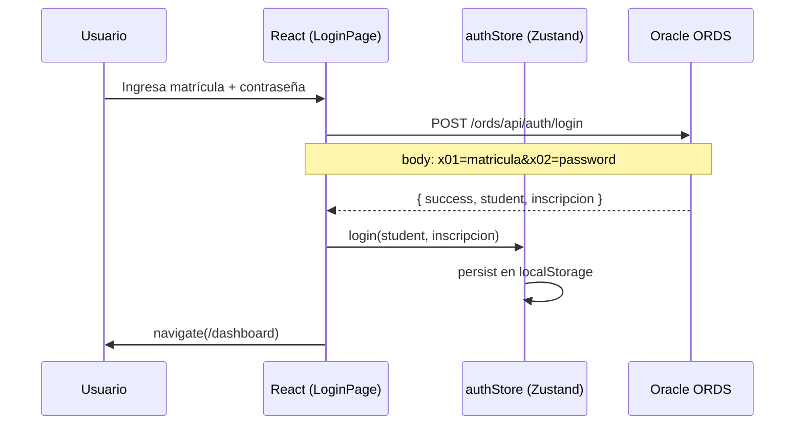
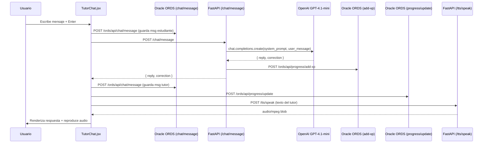
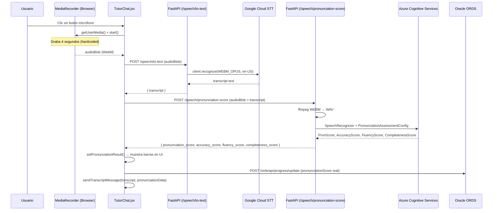
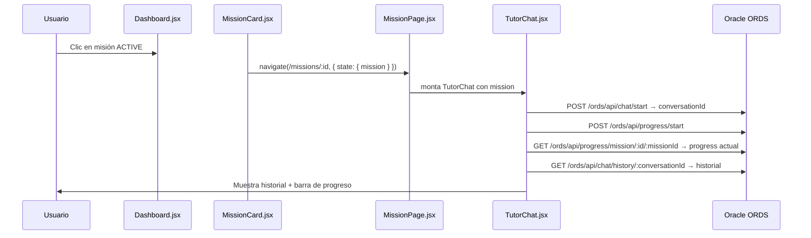
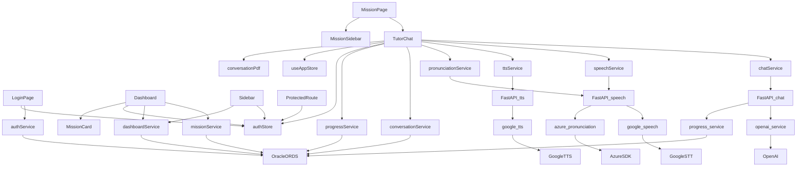

# ARCHITECTURE.md
# Activa Inglés — Arquitectura del Sistema

---

## 1. Arquitectura Actual (Estado Real)

La arquitectura actual es un sistema de dos capas con una tercera capa externa (Oracle ORDS) accesible directamente desde el frontend, lo que introduce un acoplamiento no previsto en la visión objetivo.

```
┌─────────────────────────────────────────────────────────────────┐
│                        BROWSER (Cliente)                        │
│                                                                 │
│  React SPA (Vite)                                               │
│  ├── Zustand (authStore + useAppStore)                          │
│  ├── React Router DOM                                           │
│  └── Services Layer                                             │
│       ├── authService.js      ──────────────────────────────┐  │
│       ├── missionService.js   ──────────────────────────┐   │  │
│       ├── conversationService.js ───────────────────┐   │   │  │
│       ├── dashboardService.js ──────────────────┐   │   │   │  │
│       ├── progressService.js  ──────────────┐   │   │   │   │  │
│       ├── chatService.js      ──────────┐   │   │   │   │   │  │
│       ├── speechService.js    ──────┐   │   │   │   │   │   │  │
│       ├── ttsService.js       ──┐   │   │   │   │   │   │   │  │
│       └── pronunciationService.js──┘   │   │   │   │   │   │  │
└────────────────────────────────────────┼───┼───┼───┼───┼───┼──┘
                                         │   │   │   │   │   │
         ┌───────────────────────────────┘   │   │   │   │   │
         │  FastAPI (localhost:8000)          │   │   │   │   │
         │  ├── /chat/message                │   │   │   │   │
         │  ├── /speech/to-text             │   │   │   │   │
         │  ├── /speech/pronunciation-score  │   │   │   │   │
         │  └── /tts/speak                  │   │   │   │   │
         │       │                          │   │   │   │   │
         │       ├── OpenAI GPT-4.1-mini    │   │   │   │   │
         │       ├── Google Cloud STT       │   │   │   │   │
         │       ├── Google Cloud TTS       │   │   │   │   │
         │       ├── Azure Pronunciation    │   │   │   │   │
         │       └── Oracle ORDS (add-xp)   │   │   │   │   │
         └───────────────────────────────   │   │   │   │   │
                                            │   │   │   │   │
         Oracle ORDS ◄──────────────────────┘   │   │   │   │
         (gb572ef1f8a56c6-caa23.adb...)          │   │   │   │
         ├── /ords/api/auth/login ◄──────────────┘   │   │   │
         ├── /ords/api/missions/course/:c/:i ◄────────┘   │   │
         ├── /ords/api/chat/* ◄──────────────────────────┘   │
         ├── /ords/api/progress/* ◄──────────────────────────┘
         └── Oracle ADB (tablas)
```

---

## 2. Arquitectura Objetivo (según PROJECT_VISION.md)

```
React Frontend
      ↓
  API Gateway
      ↓
   FastAPI  ◄────── TODO el tráfico debería pasar por aquí
      ↓
Servicios IA (independientes por capacidad)
      ↓
Oracle ADB
```

**Diferencia crítica:** En la arquitectura actual, el frontend se comunica directamente con Oracle ORDS para 6 de los 9 servicios, bypaseando FastAPI completamente.

---

## 3. Flujo de Autenticación



---

## 4. Flujo de Mensaje de Chat (Texto)



---

## 5. Flujo de Evaluación de Pronunciación (Voz)



---

## 6. Flujo de Inicio de Misión



---

## 7. Integraciones Externas

| Servicio | Tipo | Auth | Llamado desde | Riesgo |
|---|---|---|---|---|
| Oracle ORDS | REST API | URL pública | Frontend + Backend | Alto — acceso directo desde browser |
| OpenAI GPT-4.1-mini | REST API | API Key (.env) | Backend únicamente | Medio — sin rate limiting |
| Google Cloud Speech | gRPC/REST | JSON credentials | Backend únicamente | Bajo |
| Google Cloud TTS | gRPC/REST | JSON credentials | Backend únicamente | Bajo |
| Azure Pronunciation | SDK nativo | Key + Region (.env) | Backend únicamente | Medio — operación síncrona bloquea event loop |

---

## 8. Dependencias entre Módulos



---

## 9. Riesgos Arquitectónicos

| ID | Riesgo | Severidad | Descripción |
|---|---|---|---|
| R-01 | Frontend acoplado a Oracle ORDS | Alta | 6 servicios del frontend llaman directamente a Oracle. Un cambio en el schema rompe el frontend sin pasar por FastAPI. |
| R-02 | Backend sin autenticación | Alta | FastAPI no valida ningún token. Endpoints abiertos al mundo. |
| R-03 | Azure Pronunciation síncrona | Alta | `recognize_once()` bloquea el event loop de FastAPI durante la evaluación. |
| R-04 | Un solo punto de fallo conversacional | Alta | TutorChat.jsx orquesta todo. Un error ahí afecta el 100% de la experiencia de aprendizaje. |
| R-05 | Speech_router duplicado | Media | Rutas `/speech/*` registradas dos veces en FastAPI. |
| R-06 | Stream de micrófono no cerrado | Media | Memory leak progresivo en sesiones largas. |
| R-07 | URLs hardcodeadas en 10 archivos | Media | Imposible cambiar de entorno sin editar manualmente. |
| R-08 | Double fetch a Oracle por cada mensaje | Media | 3+ llamadas a Oracle por mensaje enviado sin batching. |
