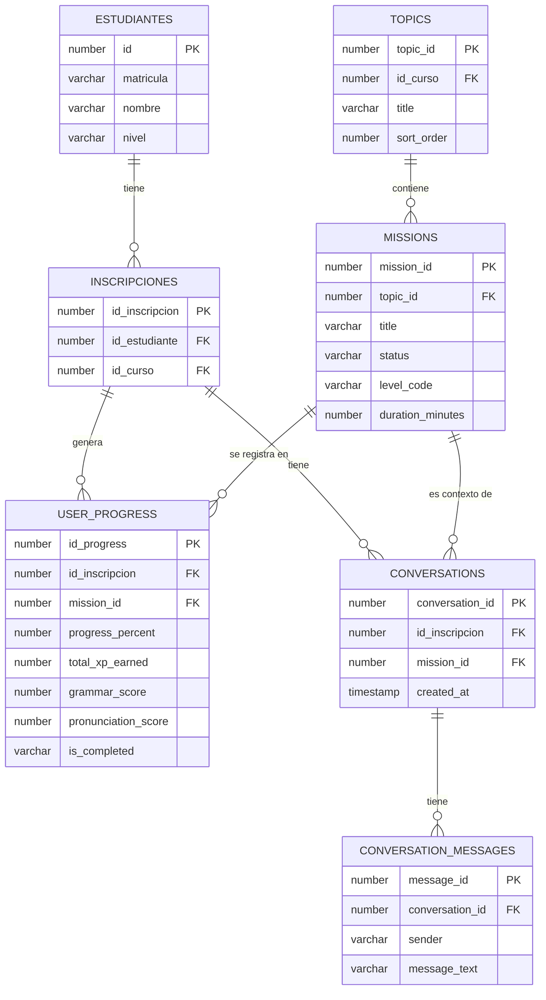

# DATABASE_MAP.md
# Activa Inglés — Mapa de Base de Datos

> **Fuente:** Oracle Autonomous Database (ADB) expuesta via Oracle REST Data Services (ORDS).
> La URL base de ORDS es: `https://gb572ef1f8a56c6-caa23.adb.us-ashburn-1.oraclecloudapps.com/ords/api/`
> Las tablas y su estructura se derivan del análisis de los endpoints ORDS y los payloads observados en el código. No se tiene acceso directo al DDL.

---

## 1. Entidades Principales

### ESTUDIANTES
Información personal del estudiante universitario.

| Campo inferido | Tipo | Notas |
|---|---|---|
| `id` o `matricula` | VARCHAR | Identificador único del estudiante |
| `nombre` | VARCHAR | Nombre completo |
| `matricula` | VARCHAR | Número de matrícula universitaria |
| `nivel` | VARCHAR | Nivel de inglés (ej. "A1") |
| `password` | VARCHAR | Contraseña (hash presumiblemente) |

**Endpoints que la usan:**
- `POST /auth/login` → lee estudiante por matrícula/password.
- El objeto `student` retornado contiene: `nombre`, `matricula`, `nivel`.

---

### INSCRIPCIONES
Relación entre un estudiante y un curso específico.

| Campo inferido | Tipo | Notas |
|---|---|---|
| `id_inscripcion` | NUMBER | PK — identificador de la inscripción |
| `id_estudiante` | NUMBER | FK → ESTUDIANTES |
| `id_curso` | NUMBER | FK → CURSOS |

**Endpoints que la usan:**
- `POST /auth/login` → retorna el objeto `inscripcion` con `idInscripcion` e `idCurso`.
- Prácticamente todos los endpoints de progress y chat usan `id_inscripcion` como identificador de contexto pedagógico.

---

### TOPICS
Temas académicos que agrupan misiones.

| Campo inferido | Tipo | Notas |
|---|---|---|
| `topic_id` | NUMBER | PK |
| `title` | VARCHAR | Nombre del topic (ej. "Daily Life") |
| `sort_order` | NUMBER | Orden de aparición |
| `id_curso` | NUMBER | FK → CURSOS |

**Endpoints que la usan:**
- `GET /missions/course/:idCurso/:idInscripcion` → retorna `topicId`, `topicTitle`, `topicSortOrder` por misión.

---

### MISSIONS
Actividades pedagógicas estructuradas.

| Campo inferido | Tipo | Notas |
|---|---|---|
| `mission_id` | NUMBER | PK |
| `topic_id` | NUMBER | FK → TOPICS |
| `title` | VARCHAR | Nombre de la misión |
| `description` | VARCHAR | Descripción pedagógica |
| `level_code` | VARCHAR | Nivel CEFR (A1, A2, B1...) |
| `duration_minutes` | NUMBER | Duración estimada |
| `grammar_title` | VARCHAR | Tema gramatical principal |
| `grammar_example` | VARCHAR | Ejemplo de la gramática |
| `sort_order` | NUMBER | Orden dentro del topic |
| `status` | VARCHAR | Estado por inscripción: LOCKED / ACTIVE / COMPLETED |

**Endpoints que la usan:**
- `GET /missions/course/:idCurso/:idInscripcion` → retorna la lista completa de misiones con su estado por inscripción.

**Campos mapeados en frontend (missionService.js):**
```
missionId, title, description, levelCode, durationMinutes,
status, grammarTitle, grammarExample, sortOrder,
topicId, topicTitle, topicSortOrder
```

---

### USER_PROGRESS
Núcleo pedagógico del sistema. Registra el progreso de un estudiante en una misión específica.

| Campo inferido | Tipo | Notas |
|---|---|---|
| `id_progress` | NUMBER | PK |
| `id_inscripcion` | NUMBER | FK → INSCRIPCIONES |
| `mission_id` | NUMBER | FK → MISSIONS |
| `progress_percent` | NUMBER | 0-100 |
| `total_xp_earned` | NUMBER | XP acumulado en esta misión |
| `total_messages` | NUMBER | Mensajes enviados |
| `total_time_minutes` | NUMBER | Tiempo en la misión (actualmente hardcodeado a 5 por mensaje) |
| `grammar_score` | NUMBER | Score de gramática (actualmente hardcodeado a 85) |
| `pronunciation_score` | NUMBER | Score de pronunciación (real cuando se usa micrófono) |
| `is_completed` | VARCHAR(1) | 'Y' / 'N' |
| `completed_date` | DATE | Fecha de completado |
| `status` | VARCHAR | Estado de la misión (ACTIVE / COMPLETED) |

**Endpoints que la usan:**
- `POST /progress/start` — Crea o reanuda el registro.
- `POST /progress/update` — Actualiza todas las métricas tras cada mensaje.
- `POST /progress/complete` — Marca como completada (NO SE LLAMA actualmente).
- `POST /progress/add-xp` — Agrega XP desde el backend de FastAPI.
- `GET /progress/mission/:idInscripcion/:missionId` — Carga progreso al entrar a la misión.
- `GET /progress/stats/:idInscripcion` — Agrega estadísticas globales para el Dashboard.

**Campos retornados por `/progress/stats/:id`:**
```
total_xp, level, xp_next_level, completed_missions,
total_missions, total_time, avg_progress,
avg_pronunciation, avg_grammar
```

---

### CONVERSATIONS
Registro de sesiones de conversación dentro de una misión.

| Campo inferido | Tipo | Notas |
|---|---|---|
| `conversation_id` | NUMBER | PK |
| `id_inscripcion` | NUMBER | FK → INSCRIPCIONES |
| `mission_id` | NUMBER | FK → MISSIONS |
| `created_at` | TIMESTAMP | Fecha de inicio |

**Endpoints que la usan:**
- `POST /chat/start` — Crea una nueva conversación. Retorna `conversationId`.
- `GET /chat/history/:conversationId` — Retorna todos los mensajes de la conversación.

---

### CONVERSATION_MESSAGES
Mensajes individuales de una conversación.

| Campo inferido | Tipo | Notas |
|---|---|---|
| `message_id` | NUMBER | PK |
| `conversation_id` | NUMBER | FK → CONVERSATIONS |
| `sender` | VARCHAR | 'student' / 'tutor' |
| `message_text` | VARCHAR/CLOB | Contenido del mensaje |
| `created_at` | TIMESTAMP | Timestamp del mensaje |

**Endpoints que la usan:**
- `POST /chat/message` — Guarda un mensaje (llamado por el frontend directamente).
- `GET /chat/history/:conversationId` — Retorna `items[]` con `{ message_id, sender, message_text }`.

---

## 2. Relaciones entre Entidades



---

## 3. Endpoints ORDS Identificados

| Método | Ruta | Llamado desde | Propósito |
|---|---|---|---|
| POST | `/auth/login` | Frontend | Autenticación del estudiante |
| GET | `/missions/course/:idCurso/:idInscripcion` | Frontend | Lista de misiones con estado |
| POST | `/chat/start` | Frontend | Crear conversación |
| POST | `/chat/message` | Frontend | Guardar mensaje individual |
| GET | `/chat/history/:conversationId` | Frontend | Cargar historial de conversación |
| POST | `/progress/start` | Frontend | Iniciar registro de progreso |
| POST | `/progress/update` | Frontend | Actualizar métricas de progreso |
| POST | `/progress/complete` | **Nunca llamado** | Marcar misión como completada |
| POST | `/progress/add-xp` | Backend (FastAPI) | Agregar XP al progreso |
| GET | `/progress/stats/:idInscripcion` | Frontend (x2) | Estadísticas globales del Dashboard |
| GET | `/progress/mission/:idInscripcion/:missionId` | Frontend | Progreso específico de una misión |

---

## 4. Observaciones Críticas

### OBS-01 — `/progress/complete` nunca se invoca
La función `completeMission()` existe en `progressService.js` y apunta a `POST /progress/complete`, pero no se llama en ningún flujo del frontend. La misión se marca internamente como "completada" vía un `alert()` cuando `progressPercent >= 100`, pero el estado `COMPLETED` en Oracle puede no actualizarse correctamente.

### OBS-02 — `grammar_score` siempre llega como 85
El endpoint `POST /progress/update` recibe `grammar_score: 85` hardcodeado desde el frontend. Oracle guarda un valor ficticio. El promedio de gramática en el Dashboard refleja este valor, no el desempeño real.

### OBS-03 — `total_time_minutes` siempre llega como 5
Por cada mensaje enviado, Oracle registra 5 minutos de estudio independientemente del tiempo real transcurrido.

### OBS-04 — `pronunciation_score` es 0 en mensajes de texto
En el flujo de texto, `updateProgress` envía `pronunciationScore: 0`. Solo el flujo de voz envía el score real. Oracle acumula ceros para todos los mensajes escritos.

### OBS-05 — Múltiples conversaciones por misión
`startConversation` crea una nueva conversación cada vez que el estudiante entra a una misión. No hay lógica de reutilización. Un estudiante que entra 10 veces a la misma misión genera 10 conversaciones en Oracle.
